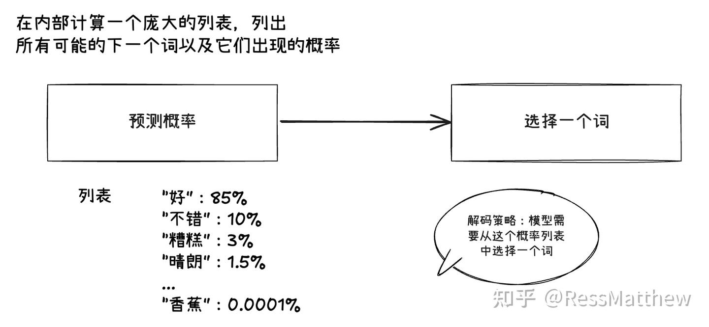
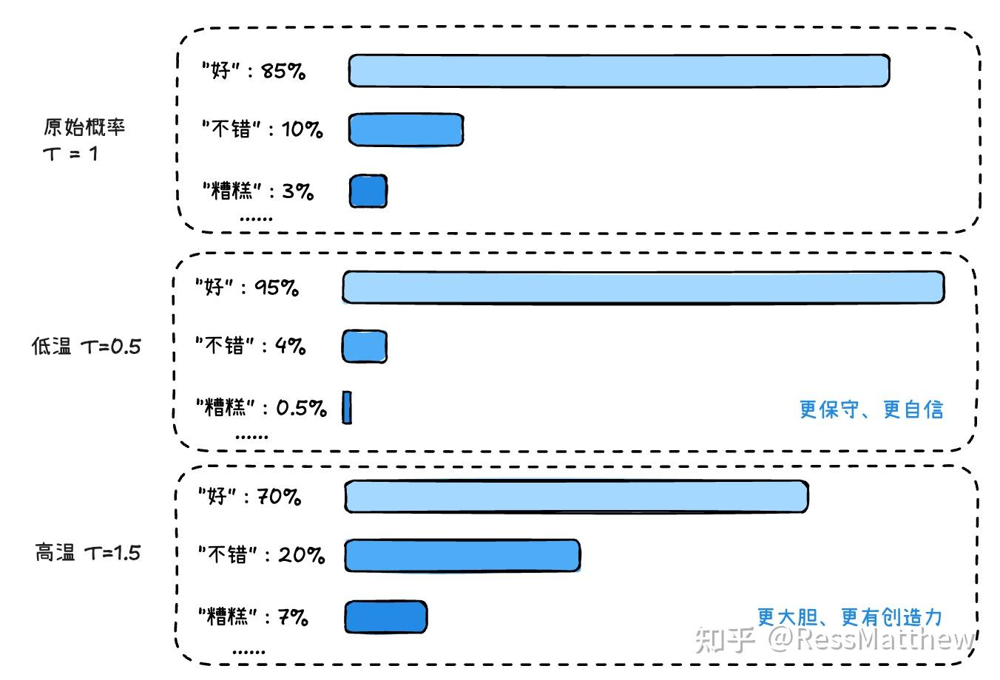
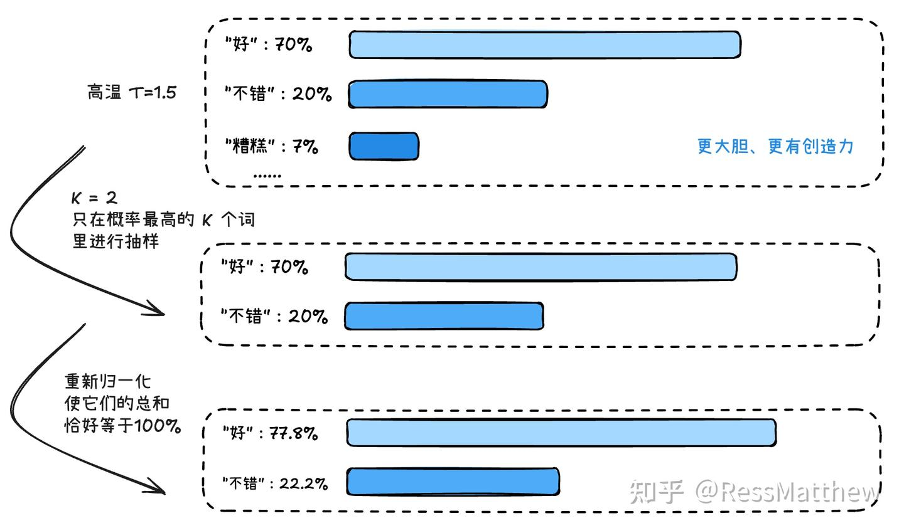
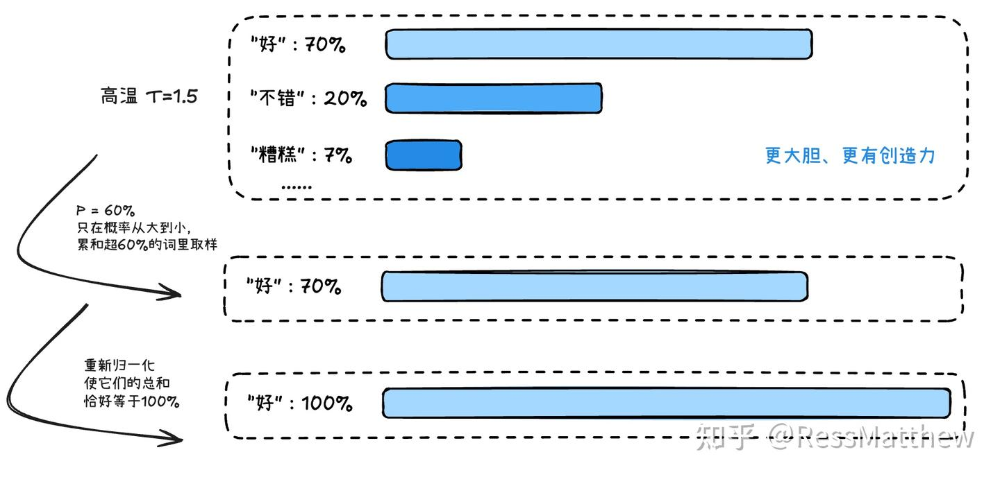
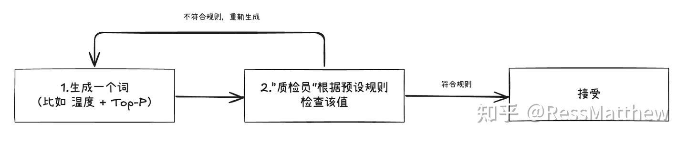
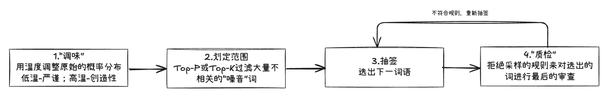

# 一篇彻底搞懂大语言模型解码策略：温度、Top-K、Top-P和拒绝采样

> **作者**：RessMatthew
> **来源**：[知乎专栏](https://zhuanlan.zhihu.com/p/1928600606718813384)

## 解码策略

[大语言模型](https://zhida.zhihu.com/search?content_id=260394082&content_type=Article&match_order=1&q=%E5%A4%A7%E8%AF%AD%E8%A8%80%E6%A8%A1%E5%9E%8B&zhida_source=entity)（LLM）的核心能力在于其强大的预测功能——它通过[自回归](https://zhida.zhihu.com/search?content_id=260394082&content_type=Article&match_order=1&q=%E8%87%AA%E5%9B%9E%E5%BD%92&zhida_source=entity)（Autoregressive）的方式，一步步地预测出下一个最可能出现的[词元](https://zhida.zhihu.com/search?content_id=260394082&content_type=Article&match_order=1&q=%E8%AF%8D%E5%85%83&zhida_source=entity)（token）。然而，模型的原始输出并不是一个确定的词，而是一个涵盖了成千上万个词元的庞大概率列表。

“解码策略”正是连接“概率”与“文本”的关键桥梁。它定义了一套规则，决定了我们如何从这个概率列表中选择出最终的词元。因此，我们选择何种解码策略，将直接影响到生成文本的风格、质量与多样性——是生成严谨保守、可预测的内容，还是富有创造力、充满惊喜的文本，完全取决于解码策略的选择。

其中，**随机性解码策略**通常包含两个环节：

1. **调整与筛选**：通过温度、Top-P 等步骤调整原始的概率分布，并筛选出候选集。
1. **采样**：在候选集里，根据新的概率分布随机选择一个词元。

最简单、最直接的策略叫做贪心搜索（Greedy Search）：每次都选择概率最高的那个词。

- 缺点：会让文本变得**重复、呆板**，容易陷入逻辑循环，缺乏创造力。

引入随机性采样（[Stochastic Sampling](https://zhida.zhihu.com/search?content_id=260394082&content_type=Article&match_order=1&q=Stochastic+Sampling&zhida_source=entity)）：根据概率分布来“抽签”，概率越高的词被抽中的机会越大。

### 温度采样

温度采样 (Temperature Sampling)。这是控制模型“创造力”最常用的旋钮之一。

温度 (Temperature) 这个参数，会改变这些“山峰”的相对高度。它的作用是在计算最终概率前，对模型输出的原始分数（logits）进行缩放。

公式： $ new\_probability_i=\frac{\exp(\mathrm{logit}_i/T)}{\sum_j\exp(\mathrm{logit}_j/T)} $

公式中 T 就是温度。高温使原始分数差距变小，模型更大胆、更有创造力；低温使原始分数差距变大，模型更保守、更自信。

### Top-K 采样

高温能让模型更有创意，但它有个风险：可能会选出完全不着边际的词。比如在“今天天气真...”的例子里，即使概率极低，模型仍有可能选出“...香蕉”。这显然是胡说八道。

Top-K 采样的目的就是为了避免这种情况，思想就是只在概率最高的 `K 个词`里进行抽样。高温后 Top-K (K=2) 采样示例如下：

### Top-P 采样

> 又叫核心采样

Top-K 的一个缺点：K 值是固定的。有时候概率分布很“平”，我们可能需要一个很大的 K 值才能包含所有合理的选项；有时候概率分布很“尖”，可能前2个词就占了99%的概率，此时一个大的 K 值反而会纳入不必要的词。

对此缺点，提出了 Top-P采样，它不再关心词的数量，而是关心概率的总量。 从概率最高的词开始往下加，直到这些词的累积概率总和超过一个阈值 P，然后就从这些词（这个集合被称为“核心”）里面进行采样。高温后 Top-P (P=0.6) 采样示例如下（“好”一个词的概率（70%）就已经超过了我们设定的阈值 P=0.6）：

### 拒绝采样

前面的温度、Top-K、Top-P 都是在决定从哪些词里“抽签”，而拒绝采样（Rejection Sampling）则更像是一个“质检员”。它在其他策略（如Top-P）选出一个词后，根据预设的规则（如“不允许重复”、“不允许出现不当词汇”）进行审查。如果符合规则就接受，不符合就拒绝并重新采样。

**代价**：可能需要多次采样才能接受一个词。

### 策略组合与比较

一个典型的高质量文本生成流水线是这样的：

对比总结：

| 策略 | 主要作用 | 优点 | 缺点 |
| --- | --- | --- | --- |
| 温度 | 创造力 | 灵活，可以动态调整“惊喜度” | 温度太高容易产生不连贯的文本 |
| Top-K | 排除低概率词 | 简单有效，避免离谱错误 | K值固定，不够灵活 |
| Top-P | 动态排除低概率词 | 智能，能根据概率分布自动调整候选集大小 | 比Top-K计算稍复杂 |
| 拒绝采样 | 强制执行特定规则 | 控制力强，可用于避免重复、保证安全等 | 规则设定需要经验，可能导致生成变慢 |

OpenAI 等公司推荐的常见做法是：**设定一个 Top-P 值（比如 0.9），然后再调整温度**，一般不建议同时修改 Top-P 和 Top-K。