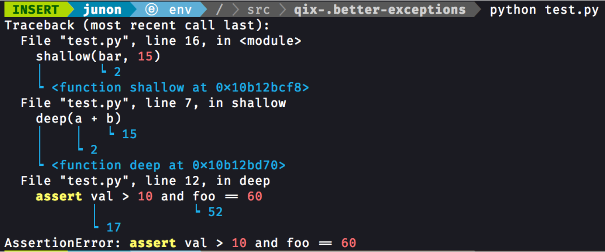
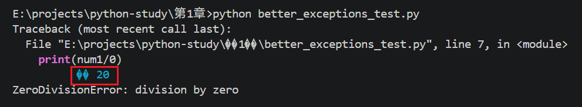

# better_exceptions
better_exceptions 是一个用于 Python 的库，它可以使在Python发生异常时显示所有上下文变量的具体值。
官方文档及仓库地址：https://github.com/Qix-/better-exceptions



我的测试：
```python
import better_exceptions
import random

better_exceptions.hook()
num1 = 10
num1 += random.randint(1, 10)

print(num1/0)
```
