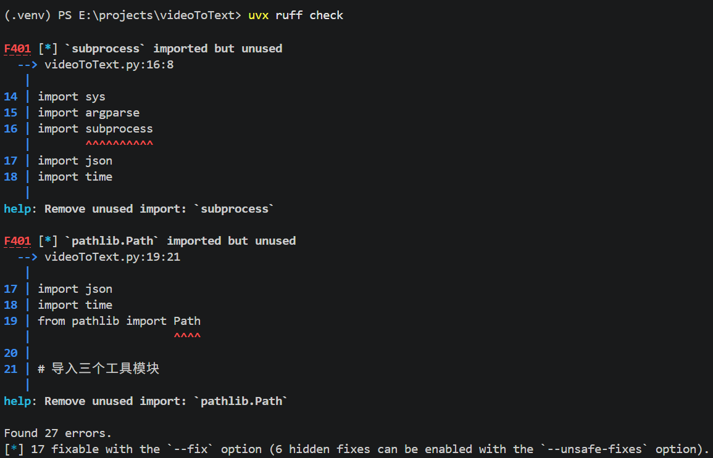
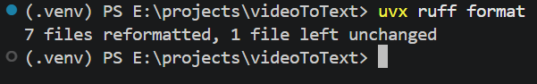

# Python现代化开发
## Ruff
Ruff一个用 Rust 编写的极其快速的 Python 代码审查器和代码格式化工具。

### 用法
```shell
uvx ruff check   # Lint all files in the current directory.
uvx ruff format  # Format all files in the current directory.
```

uvx ruff check效果如下：
运行uvx ruff check后，uv会自动帮我们安装ruff，并检查代码。

从上图可以看到，ruff检查了代码，并帮我移除了不用的包。

uvx ruff format效果如下：

从上图可以看到，ruff格式化了代码，其中7个文件被修改了，只有1个文件没有被修改。

## Pyright(Python插件内置)
VS code安装Python的时候会自动安装Pylance，而Pylance是基于Pyright的，因此Pyright不用特别安装。

## pytest自动化测试
使用 pytest 进行自动化测试：
```python
# 安装 pytest
poetry add --dev pytest
 
# 编写测试用例
# test_example.py
def test_add_numbers():
    assert add_numbers(1, 2) == 3
 
# 运行测试
pytest
```

## 日志记录
使用 Python 的内置日志模块进行日志记录，方便调试和监控。例如：
```python
import logging
 
logging.basicConfig(level=logging.INFO)
logger = logging.getLogger(__name__)
 
def main():
    logger.info("Starting the application")
    # 业务逻辑
    logger.info("Application finished")
 
if __name__ == "__main__":
    main()
```