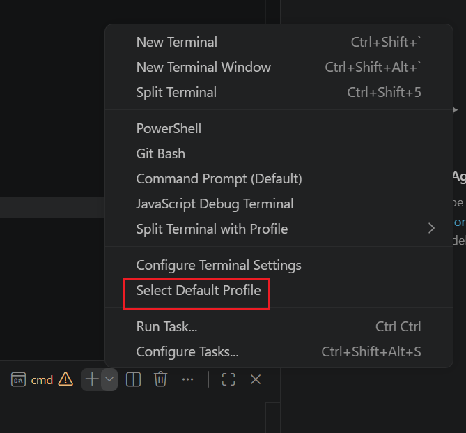

# VS Code配置教程
## 常用配置
- 自动保存

## IDEA快捷键
常用的跟IDEA一样的快捷键：
- 打开设置： Ctrl+Alt+S
- 复制一行到下方：Ctrl+D

## setting文件
直接复制以下内容到setting.json中：
```json

```

## 默认终端配置

点击terminal的+号就可以配置，建议配置为cmd，因为powershell对虚拟环境的支持比较弱。

## 多版本Python
Python的执行文件复制并改名，然后就能用别名来使用不同版本的Python。
```cmd
C:\Users\Administrator>python3.10 --version
Python 3.10.11

C:\Users\Administrator>python3.13 --version
Python 3.13.13
```

## 快捷键配置（记得删除其他冲突快捷键）
装的插件越多，快捷键就越容易冲突。
- **打开快捷键设置**：ctrl+k -> Ctrl+Shift+K
- 

# 解释器的配置
Python解释器的配置（鼠标选择）

# 用滚轮控制字体大小缩放
设置滚轮放大、缩小字体：搜索mouse wheel zoom

# 自动补全（有AI之后，不建议用）
Python自动补全函数后面的括号。
    "python.analysis.completeFunctionParens"：true

# 语法糖（有AI其实不需要）
Python用快捷键生成固定代码。：Python-snippets（支持自定义快捷键）
    自定义快捷键中的$1、$2、$3含义是第n个光标所在的位置，按Tab键就能自动移动到下一个光标所在的地方。

