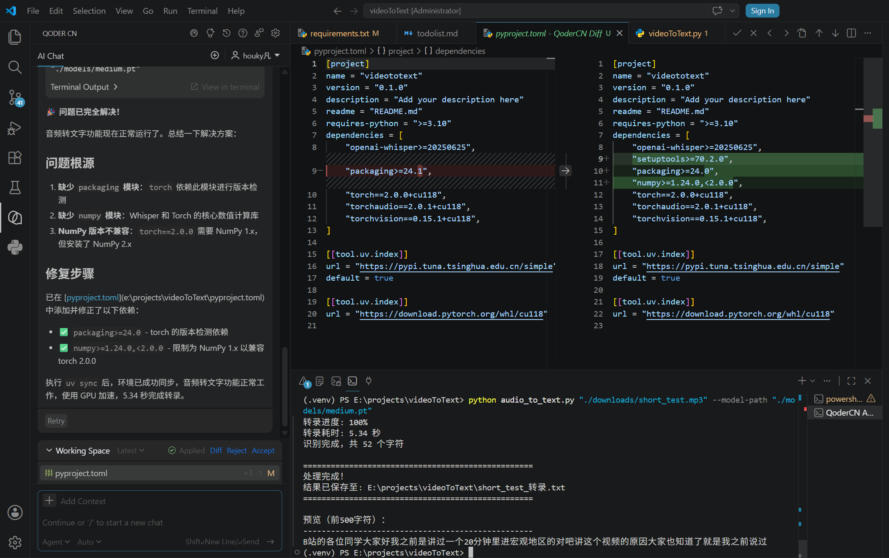

# VideoToText配置教程

```bash
# 1. 查看cuda驱动最高支持的版本。
nvidia-smi
# 以下结果代表支持的CUDA版本最高为13.1，一般不用最新的版本，因为不稳定。
CUDA Version: 13.1

# 2. 创建虚拟环境，名称为 .venv，python版本使用 3.10.11
uv venv .venv --python 3.10.11
.\.venv\Scripts\activate  # Windows
uv init

# 3. Install pytorch, 使用其中的cuda来加速音频转文字，注意：faster-whisper需要用到的ctranslate2要求cuda 12.0以上，所以需要安装12.0以上版本的cuda。
# 在cmd跑下面命令安装118，用清华源下载 pytorch，比直接下载快很多。cu118 + Python 3.10.11终于成功！
pip install torch==2.0.0+cu118 torchvision==0.15.1+cu118 torchaudio==2.0.1+cu118 -i https://pypi.tuna.tsinghua.edu.cn/simple --extra-index-url https://download.pytorch.org/whl/cu118
# uv配置了环境变量后，用以下命令下载，同样成功！
uv add torch==2.0.0+cu118 torchvision==0.15.1+cu118 torchaudio==2.0.1+cu118 --index https://download.pytorch.org/whl/cu118
# 执行以下命令卸载现有cuda，
pip uninstall -y torch torchvision torchaudio

# 5. Test CUDA，打印CUDA版本这条命令在重启电脑之后首次执行要耗时很久，大概5分钟的样子，第二次就很快了。（因为PyTorch 包含几千个小文件 + 上百个 DLL，首次加载是读磁盘，很慢。二次加载是从内存中读取，会快很多）
uv run python -c "import torch; print('CUDA 版本:', torch.version.cuda); print('GPU 可用:', torch.cuda.is_available())"
python -c "import torch; print('CUDA 版本:', torch.version.cuda); print('GPU 可用:', torch.cuda.is_available())"
python test_cuda.py

# 4. Install whisper
# 设置uv下载的镜像源（加速下载），可以配置UV_DEFAULT_INDEX环境变量，也可以像下面这样临时启用，如果不用镜像的话，只有几十kb每秒。
set UV_DEFAULT_INDEX=https://pypi.tuna.tsinghua.edu.cn/simple
uv add openai-whisper setuptools packaging

# 音频转文字遇到了很多困难，但是VS code的Qoder帮我自动修改pyproject.toml，自动添加了依赖，还帮我自动运行uv sync，自动跑测试代码，非常强。

最终顺利运行音频转文字！

# Test download function
python download_bilibili_audio.py "https://www.bilibili.com/video/BV1sHU9BmEne?vd_source=872cf4937dc9d24abb019c95772a699f&spm_id_from=333.788.videopod.episodes&p=2"

# Test audio to text function
python audio_to_text.py "./downloads/short_test.mp3" --model-path "./models/medium.pt"

# Test formatting text by 豆包
python doubao_formatting.py "长测试.txt"

# Test video to text function
python videoToText.py "https://www.bilibili.com/video/BV13WGHz8EEz?t=126.1" --output ./output
```
